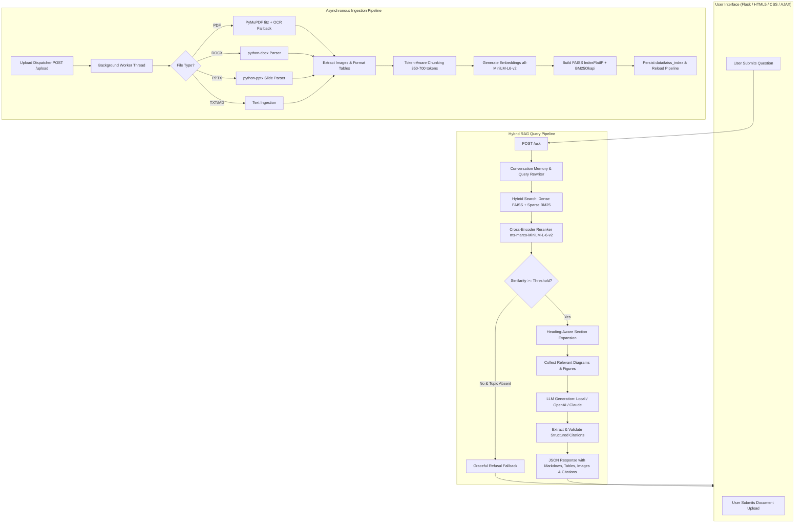

# QASubjectBot: Production-Grade Hybrid RAG Agent with Verified Source Citations

[](https://www.python.org/)
[](https://flask.palletsprojects.com/)
[](https://github.com/facebookresearch/faiss)
[](https://github.com/dorianbrown/rank_bm25)
[](https://www.sbert.net/)
[](#)

**QASubjectBot** is an enterprise-grade Retrieval-Augmented Generation (RAG) system built with **Python, Flask, FAISS, BM25, and Transformer Cross-Encoders**. It delivers comprehensive, verifiable answers across multi-format document collections (PDF, DOCX, PPTX, TXT) with strict inline citations (`[Source: filename, page/slide X]`), extracted diagrams, structured Markdown tables, formula preservation, multi-turn conversation memory, and zero-hallucination refusal fallbacks.

The system features a responsive modern web application with asynchronous multi-file ingestion, streaming PDF extraction with OCR fallback, real-time background task polling, dynamic vector re-indexing, interactive citation inspectors, and an embedded image gallery.

---

## 🌟 Key Features & Capabilities

### 1. Multi-Format Ingestion & Memory-Efficient Streaming
- **PDF Documents (`.pdf`)**: Extracted page by page using **PyMuPDF (`fitz`)** with streaming garbage collection for large textbooks (up to 200 MB), falling back to `pypdf` if needed.
- **Scanned PDF & OCR Support**: Automatically detects image-only or low-text PDF pages and runs **Tesseract OCR / PyMuPDF OCR** to recover embedded textual content.
- **Microsoft Word (`.docx`)**: Full parsing with `python-docx`, preserving paragraph structures, headings, bulleted lists, native XML tables, and embedded graphics.
- **PowerPoint Presentations (`.pptx`)**: Slide-by-slide extraction using `python-pptx`, retaining slide titles, body text, tables, speaker notes, and embedded illustrations. Cited as `[Source: filename.pptx, slide X]`.
- **Plain Text & Markdown (`.txt`, `.md`)**: Ingested with token-aware chunk boundaries.
- **Batch Uploading**: Supports uploading up to **15 files simultaneously** in either **Replace** or **Append** mode with background worker execution.

### 2. Dual-Engine Hybrid Retrieval (Dense FAISS + Sparse BM25)
- **Dense Vector Search**: Powered by `SentenceTransformer("all-MiniLM-L6-v2")` generating 384-dimensional unit L2-normalized vectors indexed via FAISS `IndexFlatIP` (Exact Inner Product Cosine Similarity). Optional support for OpenAI embeddings (`text-embedding-3-small` / `text-embedding-ada-002`).
- **Sparse Lexical Search**: Powered by **BM25Okapi** (`rank-bm25`) with specialized tokenization for exact terms, scientific formulas, numbers, and currency values.
- **Reciprocal Rank Fusion (RRF)**: Merges dense semantic hits and sparse keyword hits ($\alpha = 0.70$ dense weighting) to ensure optimal recall on both semantic and keyword-heavy queries.

### 3. Precision Cross-Encoder Reranking
- Uses `cross-encoder/ms-marco-MiniLM-L-6-v2` to jointly score `(query, passage)` pairs.
- Normalizes raw logits via Sigmoid scoring, accurately reranking top candidates to filter out false-positive lexical hits.

### 4. Heading-Aware Section Context Expansion
- When relevant chunks are retrieved, the pipeline dynamically detects heading boundaries and expands the retrieved window across the entire document section (from the section heading to the next heading).
- Guarantees complete conceptual explanations without context fragmentation while maintaining source and page citation accuracy.

### 5. Multi-Turn Conversation Memory & Query Rewriting
- Tracks multi-turn conversational history.
- Automatically resolves pronouns (*"it"*, *"its"*, *"they"*, *"this process"*) and referential follow-up questions (*"What is its main function?"*, *"Explain its disadvantages"*) into fully specified, standalone search queries before retrieval.

### 6. Embedded Media, Diagrams & Table Extraction
- **Figure & Diagram Extraction**: Embedded diagrams and pictures are extracted to `static/extracted_images/` with document and page metadata.
- **Strict Visual Grounding**: Prevents cross-document image leakage by strictly matching extracted figures to the retrieved document source, page range, and topic.
- **Native Table Parsing**: PDF and Word tables are formatted into clean GitHub-Flavored Markdown tables (`| Col 1 | Col 2 |`).
- **Formula & Calculation Preservation**: Mathematical formulas, arithmetic breakdowns, and chemical equations are detected, formatted, and highlighted.

### 7. Strict Grounding & Refusal Fallbacks
- **Zero Hallucination Policy**: Answers are strictly synthesized from retrieved document chunks.
- **Mandatory Inline Citations**: Every key statement or paragraph includes verifiable citations referencing the exact source document and page/slide number: `[Source: filename.pdf, page 12]` or `[Source: lecture.pptx, slide 4]`.
- **Out-of-Scope Refusal**: When queries fall below confidence thresholds or lack grounding in the corpus, the agent gracefully returns:
  > *"I don't have enough information on that based on the provided documents."*

### 8. Flexible LLM Backend Support
- **Native Local Deterministic Generator**: Works 100% offline out of the box with zero external API keys or token costs, synthesizing grounded passages with exact citations.
- **OpenAI Integration**: Automatically activates when `OPENAI_API_KEY` is present (supports `gpt-4o-mini`, `gpt-4o`, `gpt-3.5-turbo`).
- **Anthropic Integration**: Automatically activates when `ANTHROPIC_API_KEY` is present (supports `claude-3-5-sonnet-20241022`, `claude-3-haiku-20240307`).

---

## 🏗️ Technical Architecture & Pipeline Flow



---

## 🌐 Flask Web API Endpoints

| Endpoint | Method | Description | Request Payload / Parameters | Response Schema |
| :--- | :---: | :--- | :--- | :--- |
| `/` | `GET` | Main Web Application UI | None | Rendered HTML Webpage |
| `/upload` | `POST` | Upload files and trigger indexing | `multipart/form-data` with `files` (up to 15), `mode` (`replace` or `append`), and optional `async=true` | JSON `{status: "processing" \| "success", task_id, message, uploaded_files: [...]}` |
| `/api/upload-status/<task_id>` | `GET` | Poll real-time upload progress | URL parameter `task_id` | JSON `{task_id, status: "pending" \| "processing" \| "completed" \| "error", progress_pct, stage, message, current_file, current_page, total_pages, result}` |
| `/ask` | `POST` | Query the grounded RAG agent | JSON `{question: string, top_k?: int, score_threshold?: float, conversation_history?: list}` | JSON `{query, effective_query, answer, citations: [...], images: [...], has_images: bool, has_tables: bool, has_calculations: bool, retrieval_confidence: float, status: "success" \| "insufficient_context", latency_ms: float}` |
| `/api/documents` | `GET` | List active corpus documents & stats | None | JSON `{status: "success", total_documents: int, total_chunks: int, embedding_model: string, reranker_model: string, llm_provider: string, documents: [...]}` |

---

## 📊 Benchmark Evaluation Results

The pipeline was benchmarked using a 15-question evaluation suite covering **Easy Factual**, **Multi-Hop / Comparative**, and **Out-of-Scope / Negative Control** queries against the Biopsychology corpus (`UNIT_1_BIOPSYCHOLOGY.pptx`, `UNIT_2_BIOPSYCHOLOGY.pdf`, `UNIT_3_BIOPSYCHOLOGY.pdf`):

| Metric | Measured Result | Benchmark Target | Status |
| :--- | :---: | :---: | :---: |
| **Overall Accuracy** | **93.3%** (14/15) | $\ge$ 85.0% | **PASS** |
| **In-Scope Factual & Multi-Hop Accuracy** | **90.9%** (10/11) | $\ge$ 85.0% | **PASS** |
| **Source Citation Accuracy** | **100.0%** (11/11) | $\ge$ 90.0% | **PASS** |
| **Out-of-Scope Refusal Rate** | **100.0%** (4/4) | 100.0% | **PASS** |
| **Average In-Scope Confidence Score** | **0.9922** | > 0.3500 | **PASS** |
| **Average Out-of-Scope Confidence Score** | **0.1445** | < 0.2000 | **PASS** |

*For complete query traces and per-question score logs, see [`eval_report.md`](eval_report.md).*

---

## 🧪 Automated Test Suite

QASubjectBot includes 8 comprehensive automated test suites using `pytest`:

| Test Module | Coverage & Verification Focus |
| :--- | :--- |
| `tests/test_flask_app.py` | Flask route endpoints, `/upload`, `/ask`, `/api/documents`, error handling, input validation |
| `tests/test_async_upload.py` | Background worker task creation, task state updates, and `/api/upload-status/<task_id>` polling |
| `tests/test_hybrid_and_reranker.py` | BM25 tokenization, reciprocal rank fusion, Cross-Encoder reranking, and confidence scoring |
| `tests/test_ingestion.py` | PyMuPDF extraction, text cleaning, tiktoken chunking, and metadata tagging |
| `tests/test_multiformat_ingestion.py` | Multi-format loaders (PDF, Word DOCX, PowerPoint PPTX, TXT), slide citation units, and mixed uploads |
| `tests/test_media_and_tables.py` | Image extraction, document isolation, table markdown formatting, and calculation detection |
| `tests/test_rag_pipeline.py` | Hybrid search, conversation memory rewriting, heading expansion, citations, and refusal fallbacks |
| `tests/test_phase15_comprehensive.py` | End-to-end integration across async tasks, hybrid retrieval, section expansion, and web UI |

Run all tests with:
```bash
python -m pytest tests/ -v
```

---

## 🚀 Quickstart & Installation Guide

### 1. Prerequisites
- **Python 3.10+** (Python 3.11 recommended)
- **pip** and **virtualenv**
- *(Optional)* Tesseract OCR for scanned PDF text extraction

### 2. Clone and Setup Environment
```bash
# Clone the repository
git clone https://github.com/SyedKhalid1046/QASubjectBot.git
cd QASubjectBot

# Create and activate a virtual environment
python -m venv venv

# On Windows:
.\venv\Scripts\activate
# On macOS / Linux:
source venv/bin/activate

# Install dependencies
pip install -r requirements.txt
```

### 3. (Optional) Configure Environment Variables
Copy `.env.example` to `.env` to configure external LLMs:
```bash
cp .env.example .env
```
Edit `.env` as desired:
```env
# Optional External LLM Keys (QASubjectBot works 100% locally if omitted)
OPENAI_API_KEY=your_openai_api_key_here
OPENAI_MODEL=gpt-4o-mini

ANTHROPIC_API_KEY=your_anthropic_api_key_here
ANTHROPIC_MODEL=claude-3-5-sonnet-20241022
```

### 4. Launch the Web Application
```bash
python app.py
```
Open your browser and navigate to:
```
http://127.0.0.1:5000
```

### 5. Run Ingestion or Evaluation via CLI
- **Re-ingest documents in `documents/`:**
  ```bash
  python ingestion.py
  python embed_index.py
  ```
- **Execute the evaluation benchmark suite:**
  ```bash
  python evaluate.py
  ```

---

## 📁 Repository Directory Structure

```
QASubjectBot/
├── app.py                            # Flask server with /upload, /api/upload-status, /ask, /api/documents
├── ingestion.py                      # Multi-format document loader (PDF, DOCX, PPTX, TXT), OCR, chunker
├── embed_index.py                    # Dense embeddings (all-MiniLM-L6-v2), BM25Okapi, and FAISS indexing
├── rag_pipeline.py                   # Hybrid search, Cross-Encoder reranker, memory, heading expansion, citations
├── evaluate.py                       # Automated benchmark evaluation script
├── eval_report.md                    # Benchmark report with quantitative metrics and test logs
├── requirements.txt                  # Python package dependencies
├── .env.example                      # Environment variables configuration template
├── README.md                         # Project documentation
├── documents/                        # Corpus document storage (PDF, DOCX, PPTX, TXT)
│   ├── UNIT_1_BIOPSYCHOLOGY.pptx
│   ├── UNIT_2_BIOPSYCHOLOGY.pdf
│   └── UNIT_3_BIOPSYCHOLOGY.pdf
├── data/
│   ├── processed_chunks.json         # Ingested chunks with token counts, tables, and image metadata
│   └── faiss_index/                  # Serialized FAISS index (IndexFlatIP), BM25 pickle, and chunk mapping
├── templates/
│   └── index.html                    # Semantic HTML5 frontend interface
├── static/
│   ├── style.css                     # Modern dark/light glassmorphic stylesheet and micro-animations
│   ├── script.js                     # AJAX client for async upload polling, chat streaming, and citation viewer
│   └── extracted_images/             # Directory where figures and diagrams are extracted
├── scripts/
│   └── generate_corpus.py            # Synthetic multi-page corpus generator
└── tests/
    ├── test_async_upload.py          # Asynchronous upload and status polling tests
    ├── test_flask_app.py             # Flask endpoints and request validation test suite
    ├── test_hybrid_and_reranker.py   # BM25 + FAISS hybrid search and Cross-Encoder tests
    ├── test_ingestion.py             # PyMuPDF ingestion and text chunking tests
    ├── test_media_and_tables.py      # Diagram extraction, markdown tables, and calculation tests
    ├── test_multiformat_ingestion.py # Multi-format ingestion (DOCX/PPTX) and mixed upload tests
    ├── test_phase15_comprehensive.py # Comprehensive integration test suite
    └── test_rag_pipeline.py          # RAG pipeline, citation generation, and refusal fallback tests
```

---

## 📄 License & Attribution

This project is licensed under the MIT License. Developed as a production-grade question-answering agent demonstrating domain-agnostic document ingestion, verified source citations, and hybrid retrieval.
